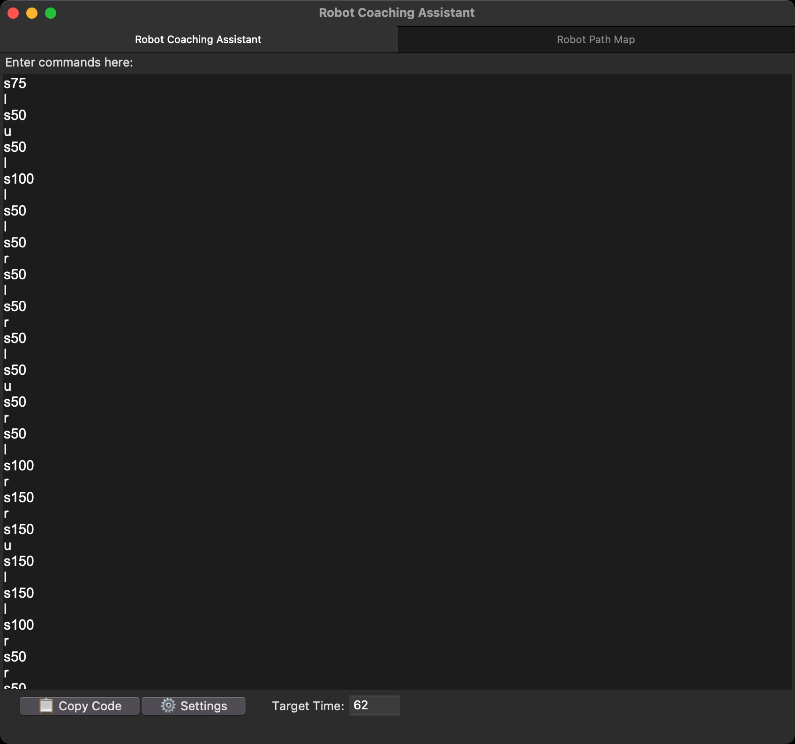
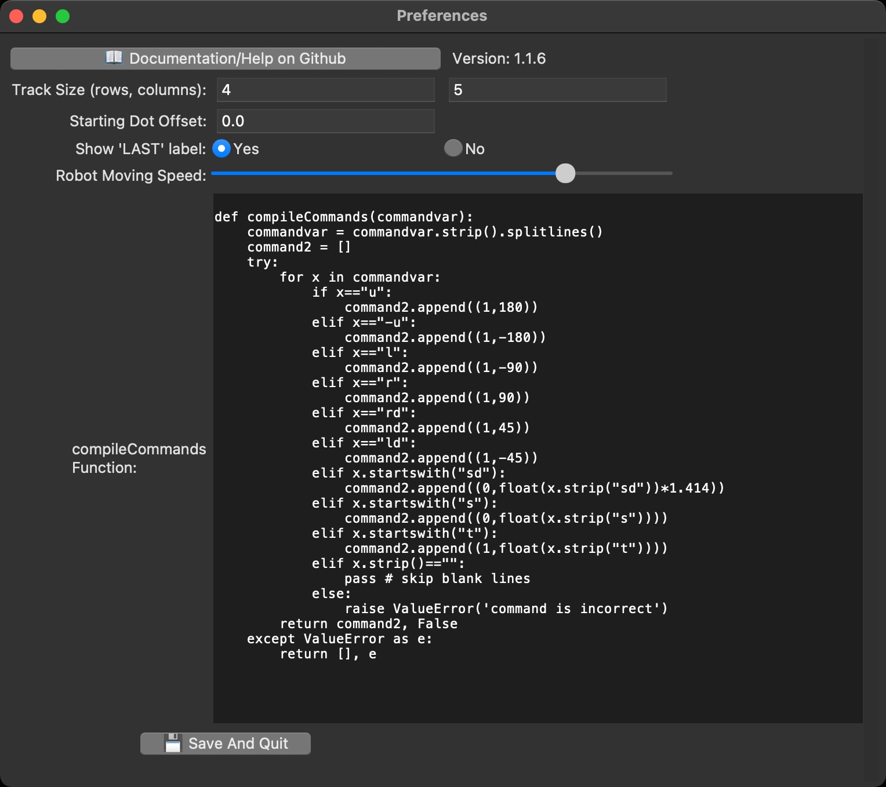

# [](icon.png)  Robot Coaching Assistant (RCA)

A tool to simulate a robot's path for robot tour in Science Olympiad. \
⚠️You MUST set up `compileCommands` to use this. [How to configure compileCommands](docs/COMPILE_COMMANDS.md)

## Usage
* Add barriers, start point, and end point with the `Set Course` button. In course editing mode, simply click on elements to activate them.\
  
* Add gates with the `Set Gates` button. Make sure to click on the gate zones **in order**, as the last gate clicked is marked as the last zone.
* Paste in or type in your robot's movements, and the path will show up!
* Add the target time on the main window, and then click `Photo Mode` in the course to take a screenshot of the course, with target time.
* Click `Robot Moving Animation` to get an animation of the path
* Save and load the course (and robot code) with the `Save Course` and `Load Course` buttons.

### Settings
* **Track Size:** size of the robot tour course. 4x4 for 2023-24, 4x5 for 2024-25
* **Starting Dot Offset** (default: 0): How far, in cm, the icon is from the course's edge when starting. Useful when the first move is longer than expected in order to align the center of the robot with the center of the box. For example, my bot travels 32cm instead of 25cm on the first move because the dowel is 7cm in front of the center.
* **Show 'LAST' label**: indicate that the last clicked gate zone must be entered at the end for a bonus. This can be disabled for the 2023-24 rules and enabled for the 2024-25 rules.
* **Robot Moving Speed:** the speed of the robot moving animation
* **compileCommands Function:** read [how to configure compileCommands](docs/COMPILE_COMMANDS.md)

### Screenshots

*Map with a robot course*\
&nbsp;\

*Page to enter path*\
&nbsp;\

*Settings of the app*

## Troubleshooting
- **macOS:** `“Robot Coaching Assistant.app” is damaged and can’t be opened.` can be fixed by running this command in terminal:
    ````
    xattr -rd com.apple.quarantine /Applications/Robot\ Coaching\ Assistant.app
    ````


### Building From Source
See [building from source](docs/BUILDING_SRC.md)
