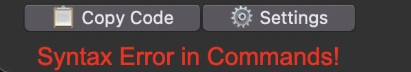

## Configuring `compileCommands`
Every robot has a different method for interpreting a path, so I have exposed the function that interprets the path.

`compileCommands` must be a python function that takes one input, the multiline-string of commands that you type in.
It must `return commands_array,error`
If there is **no** error, then error should equal `False`
If there is an error, then commands_array should equal `[]`

When there is an error, this message appears to warn you that your commands will fail: \

`commands_array` must be an array of tuples, with each tuple being a command 
The first element of each tuple will either be `0`, for straight motion, or `1` to turn.
The second element is a number (deciamls are fine): either the number of degrees to turn (negative for counterclockwise, positive for clockwise), or the number of centimeters to travel (negative for backwards; positive for forward)

For example, if the path is:
`Forward 100cm, Right 90 degrees, Forward 50cm, Left 45 degrees, Backward 50cm`
Then, the interpreted commands is:
`[(0, 100.0), (1, 90), (0, 50.0), (1, -45.0), (0, -50.0)]`
> If you would like to directly use this interpreted format, then use [this compileCommands example](examples/compileCommands_example_1.py)

> A [default compileCommands](examples/compileCommands_example_default.py) has been provided. The default compileCommands uses a very **human-readable format**:
> * **sX**: Go stratight by X centimeters (e.g. s100 for 100 cm)
> * **r**: turn right 90°
> * **l**: turn left 90°
> * **u**: turn 180°
> * **tX**: turn by X°, where negative is left and positive is right
> * <ins>**DIAGONALS:**</ins>
>     * **sdX**: Go straight by X cm × √2 *(because the diagonal of a square is side length × √2)*
>     * **rd**: turn right 45°
>     * **ld**: turn left 45°

 &nbsp;
Feel free to contact me at [contact@abhijeetghosh.com](mailto:contact@abhijeetghosh.com) if you need help making your `compileCommands`
